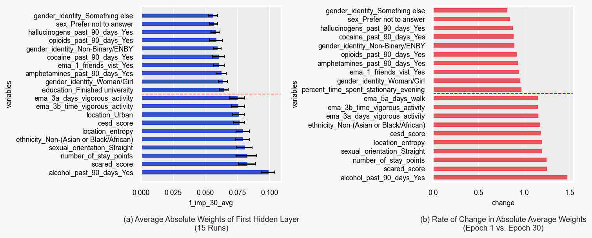

# White-Paper-Anxiety-Prediction ([Read the Paper (PDF)](Developing_A_Machine_Learning_Model_to_Predict_Anxiety_Levels.pdf))

This project explores the use of **machine learning** to predict **anxiety levels** using **mobile sensing data**. Our aim is to improve early detection of anxiety disorders, leveraging real-world behavioral patterns instead of traditional clinical assessments.

## The Challenge

**Problem:**
Traditional medical tests struggle with **low disease prevalence**, resulting in **high false positive rates** that burden healthcare systems.

**Goal:**
Develop a **reliable ML model** that can **identify anxiety disorders** with high precision, especially under **class imbalance** conditions.

## Data Overview

* **Source:** `PROSIT` app
* **Participants:** 161 individuals
* **Duration:** 2 weeks
* **Observations:** 322 data points
* **Features:**

  * Mobile phone usage
  * Sleep patterns
  * GPS mobility
  * Self-reported well-being
* **Class Imbalance:** \~1:4 (Anxiety vs. Healthy)

## Understanding Model Probabilities

In healthcare, **well-calibrated probabilities** are crucial. They aid in informed decision-making, especially when dealing with rare conditions.

### Why Probabilities Matter:

* Allow for **threshold-independent** classification
* Reflect the **true prior** in imbalanced datasets
* Help understand the **likelihood** of actual diagnosis

### Example Calculation

> If:
>
> * Prevalence (prior) = 0.05
> * True Positive Rate (TPR) = 0.9
> * False Positive Rate (FPR) = 0.1
>
> Then:
>
> $$
> P(\text{anxiety} \mid +) = \frac{0.9 \cdot 0.05}{0.9 \cdot 0.05 + 0.1 \cdot 0.95} \approx 0.346
> $$

This means that **even a strong test yields modest confidence** under low prevalence.

* As the **prior increases**, posterior probabilities improve
* Even with a **99% TPR**, a low prior suppresses confidence

## Traditional Tests vs. Machine Learning

| Aspect                   | Traditional Tests | ML Models                     |
| ------------------------ | ----------------- | ----------------------------- |
| Prior Awareness          | ❌                 | ✅                             |
| Threshold Flexibility    | ❌                 | ✅                             |
| Probability Calibration  | ❌                 | ⚠️ Depends on model           |
| Class Imbalance Handling | Manual            | Built-in options (with risks) |

**Important:** Oversampling or balancing may improve performance **but distort probability estimates**.

### Our Results:

* Probabilities were **well-calibrated**
* Posterior matched **true class distribution**

  

## Exploring Model Weights

We analyzed **first-layer weights** to estimate **feature importance** across 15 runs, loosely interpreting them as some form of feature importance. For more information refer to the paper.

### Caveats:

* Early weights are affected by deeper layers
* Neural networks are **nonlinear**, making direct interpretation difficult

### Key Findings:

* **Alcohol consumption** was the most influential feature
* Weight patterns aligned with **AdamW decay dynamics**. We were interested in either those that increased or decreased but substantially (see the figure below)

  

  

## Summary

This project demonstrates the **potential of ML in mental health diagnostics**, especially in navigating challenges like:

* Class imbalance
* Low disease prevalence
* Probability calibration
